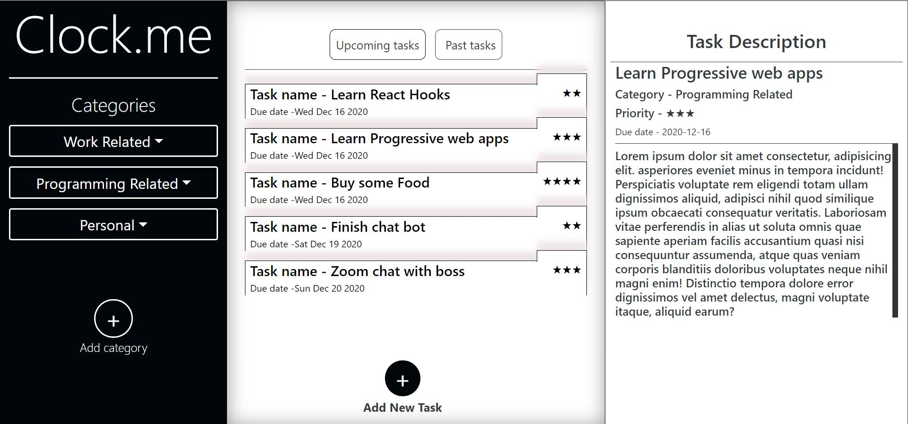

# Clock.me Todo list application with TDD and Functional Programming
> This is a javascript project made to create a todo list application by dynamically rendering it using JavaScript DOM manipulation and local storage. JavaScript is used to generate the entire contents of the website. A user can create, edit and delete tasks. Jest is used to perform test driven development.

> Core Principles of Functional Programming can be found [here](https://www.freecodecamp.org/news/an-introduction-to-the-basic-principles-of-functional-programming-a2c2a15c84/)
## Built With

- JavaScript
- HTML
- CSS
- ES6 Modules
- Webpack
- Jest
- npm
- Eslint
- StyleLint

## Live Demo

[Clock.me Live Demo](https://rawcdn.githack.com/Berabjesus/Js-clock.me-todo-list-with-functional-programming/6df498301a1fe68429b2d7f86ada8a7c21a2e7cd/dist/index.html)

# ScreenShots
### Home Page

### Prerequisites
- Web browser
- CLI tool

## Getting Started
- Clone this repo on your local machine
- Go to the cloned folder
- If you want to repack the file
  - Run `npm install` on the terminal to install dependancies
  - Run `npm run build` to pack the files in the src folder
  - Go to the dist folder and open index.html
  - Run `npm run start` to open it on a live server. NB The port is set to 3000. Go the webpack.config file to change it 
- Else
  - Just Go to the dist folder and open index.html
## Testing
- Go to the root directory
- Open a CLI tool and type `npm run test`

## Author

👤 **Bereket Beshane**

- Github: [@Berabjesus](https://github.com/Berabjesus)
- Twitter: [@bereket_ababu_b](https://twitter.com/bereket_ababu_b)
- Linkedin: Linkedin: [linkedin](https://www.linkedin.com/in/bereket-beshane-a1b75a1a9/) 

## 🤝 Contributing

Contributions, issues and feature requests are welcome!

Feel free to check the [issues page](https://github.com/Berabjesus/Js-todo-list-with-functional-programming/issues).

## Show your support

Give a ⭐️ if you like this project!

## Acknowledgments
- Microverse
- TheOdinProject

## 📝 License

This project is [MIT](lic.url) licensed.
